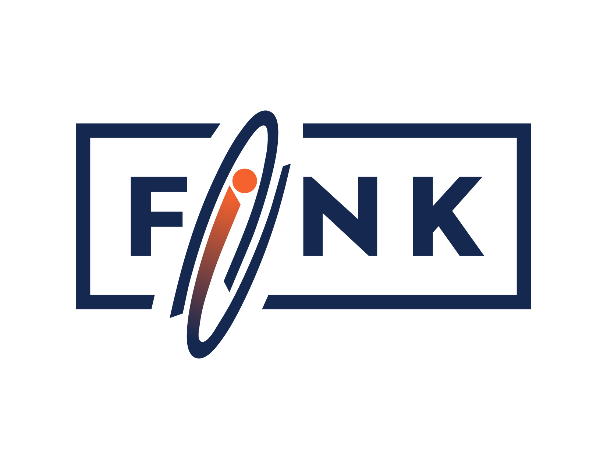

#  

## Fink: early supernovae Ia classification using active learning

This repository contains code allowing reproducibility of results presented in [Leoni et al., 2022, Astronomy & Astrophysics, Volume 663, id.A13, 10 pp](https://ui.adsabs.harvard.edu/abs/2022A%26A...663A..13L/abstract). 

We list below a general description of each script/notebook. 

The data necessary to reproduce these results are available through [zenodo](https://zenodo.org/record/5645609#.YcD3przMJNg).

- [actsnfink/sigmoid.py](https://github.com/emilleishida/fink_sn_activelearning/blob/master/actsnfink/sigmoid.py): 
    functions related to the sigmoid feature extraction
    
- [actsnfink/classifier_sigmoid.py](https://github.com/emilleishida/fink_sn_activelearning/blob/master/actsnfink/classifier_sigmoid.py): 
    functions related to filtering points on the rise and concatenation with extra features (SNR, npoints, chi2) with sigmoid fit parameters

- [actsnfink/early_sn_classifier.py](https://github.com/emilleishida/fink_sn_activelearning/blob/master/actsnfink/early_sn_classifier.py):
    global functions for feature extraction and learning loop. 
    
- [actsnfink/notebooks/mean_model.ipynb](https://github.com/emilleishida/fink_sn_activelearning/blob/master/actsnfink/notebooks/mean_model.ipynb):
    Extract best performing model from a given query strategy, save pkl file and generate list of alerts used of training.
    
- actsnfink/notebooks/0X with X \in [1,2,3,4,5,7]:
    Jupyter notebooks for reproducing the plots in [Leoni et al., 2022](https://ui.adsabs.harvard.edu/abs/2022A%26A...663A..13L/abstract)
    
- actsnfink/scripts/run_loop.py
    Example script on how to use this package. 
    
- [LICENSE](https://github.com/emilleishida/fink_sn_activelearning/blob/master/LICENSE):
    MIT License
    
## Installation

Create a virtual environment following [these instructions](https://uoa-eresearch.github.io/eresearch-cookbook/recipe/2014/11/26/python-virtual-env/). Source it and install the [actsnclass](https://github.com/COINtoolbox/ActSNClass) package.

Then you can install the other dependencies using pip:

```
python3 -m pip install -r requirements.txt
```

Then you can install the functionalities of this package.

```
python setup.py install 
```

## Rainbow

If you wish to use the `Rainbow` features from [Russeil et al., 2023](https://arxiv.org/abs/2310.02916) it is also necessary to install the `light_curve` package by [Malanchev et al., 2021](https://ui.adsabs.harvard.edu/abs/2021MNRAS.502.5147M/abstract) as presented by E. Russeil [here](https://github.com/erusseil/light-curve-python).


